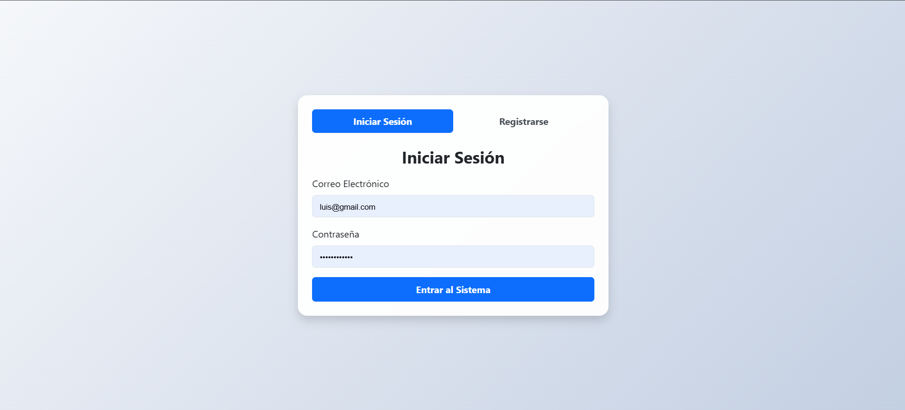
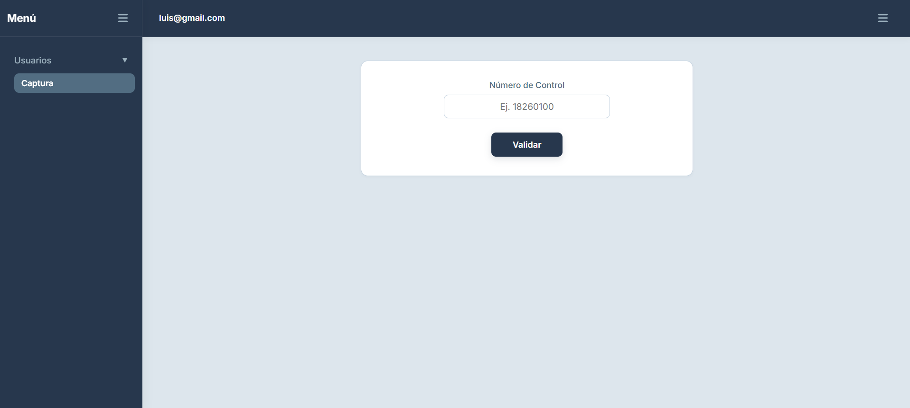

# Login

**Nombre del Proyecto:** Login  
**Materia/Módulo:** Programación Web  
**Equipo de Trabajo:**  
* Edwin Alexis Esperanza Chavez  
* Felix Eliel Olivera Jimenez 

Este proyecto es una aplicación web responsiva e interactiva que permite gestionar usuarios en tiempo real utilizando almacenamiento local (`localStorage`). Cuenta con un panel principal con menú lateral (`sidebar`) colapsable, barra superior (`navbar`) con menú flotante de usuario, validación de estado de edad (mayor/menor de edad), asignación de número de control y un modal para el registro de nuevos usuarios con efecto de desenfoque de fondo (`backdrop blur`).

---

## Documentación

### 1. Framework CSS Utilizado
* **CSS3 Puro (Vanilla CSS):** No se utilizaron frameworks externos (como Bootstrap o Tailwind). Se implementaron **Variables CSS (`:root`)** para mantener una paleta de colores coherente bajo la **regla del 60-30-10**:
  * **60% Dominante (`#DDE6ED`):** Fondo general de la interfaz.
  * **30% Secundario (`#27374D` / `#526D82`):** Estructuras del Sidebar, Navbar y encabezados.
  * **10% Acento (`#9DB2BF`):** Botones e interacciones `:hover`.
* **Bootstrap 5 (Para el módulo de Acceso):** Se empleó Bootstrap 5 exclusivamente en la pantalla de `login.html` para estructurar con agilidad las tarjetas de acceso y los formularios de autenticación y registro.

### 2. Flujo del Login hacia el Sistema
1. **Página de Login (`login.html`):** El usuario ingresa sus credenciales. El script valida la existencia del usuario y su contraseña en el `localStorage`.
2. **Autenticación y Persistencia:** Al ser válidas las credenciales, se guarda el identificador de la sesión activa en el almacenamiento local y se redirige automáticamente hacia la pantalla principal del sistema:
   ```javascript
   localStorage.setItem('sesionActiva', email);
   window.location.href = 'index.html';
   ```
3. Cómo se pasa el Nombre de Usuario al Navbar
Al cargar la pantalla principal (index.html), el script principal (main.js) extrae el valor almacenado en localStorage bajo la clave de sesión y lo inyecta dinámicamente en el elemento del Navbar designado para el perfil del usuario:

```javascript
const usuarioActivo = localStorage.getItem('sesionActiva');
const userNameSpan = document.querySelector('.user-name');
if (usuarioActivo && userNameSpan) {
    userNameSpan.textContent = usuarioActivo;
}
```
Asimismo, el menú desplegable del perfil incluye la opción de Cerrar Sesión, la cual limpia la clave de sesión del navegador y redirige al usuario de vuelta a login.html.

4. Métodos Principales de la Librería de Validación (utileria.js)
El sistema integra una librería centralizada de validación que expone los siguientes métodos principales:

validarCorreo(correo): Verifica mediante expresiones regulares (Regex) que la estructura del correo sea legítima.

validarContra(contraseña): Comprueba que la contraseña cumpla con criterios de seguridad (longitud mínima, mayúsculas, minúsculas, números y caracteres especiales).

validarLongitud(numero, maxLongitud): Evalúa que la longitud de una cadena o número no exceda el límite permitido.

soloLetras(texto): Filtra cadenas para asegurar que únicamente contengan caracteres alfabéticos y espacios.

### 3. Proceso de Creación (Paso a Paso)
Creación de la estructura HTML e Iconos: Estructuración inicial de contenedores, barras de navegación y áreas de contenido.

Aplicación de Estilos con CSS: Diseño visual del panel aplicando las variables de color y distribución responsiva.

Formulario Modal de Captura: Creación de la interfaz flotante en el menú lateral para el registro de nuevos usuarios con efectos visuales de desenfoque.

Módulo de Login y Validación del Número de Control: Integración de la pantalla de acceso (login.html) y validación estricta del número de control a 6 dígitos mediante la librería Utileria.

### Capturas del Flujo Completo Funcionando
Pantalla de Inicio de Sesión (login.html):


Pantalla Principal (index.html) con Sesión Activa:
